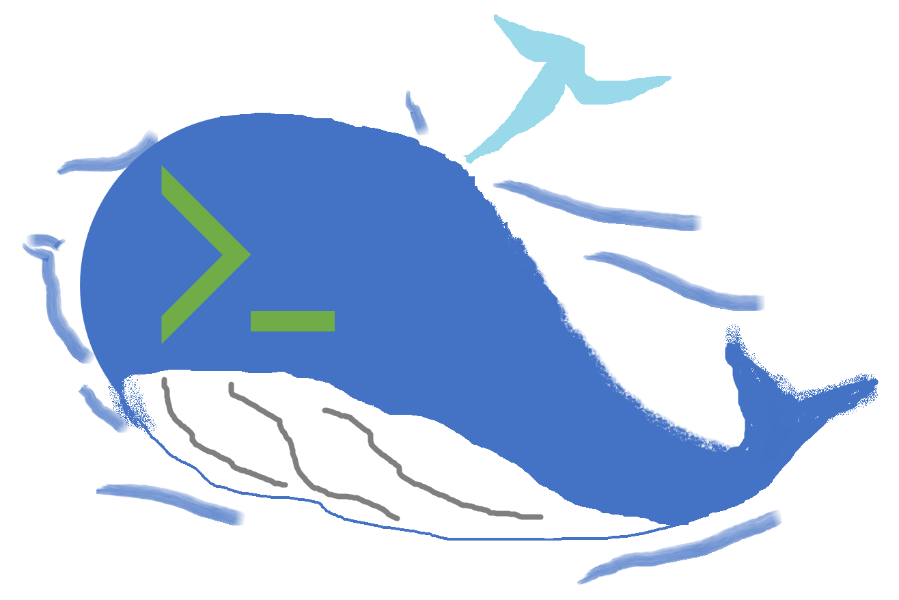

# DOTER

[](https://npmjs.org/package/doter)
[](https://npmjs.org/package/doter)
[](https://github.com/oktntko/doter/blob/master/package.json)

<!-- PROJECT LOGO -->
<br />
<p align="center">
  <a href="https://github.com/oktntko/doter">
    
  </a>

  <h3 align="center">DOTER</h3>

  <p align="center">
    I want to Docker Desktop even with Terminal!
    <br />
    <a href="https://github.com/oktntko/doter"><strong>Explore the docs »</strong></a>
    <br />
    <br />
    <a href="#about-the-project">View Demo</a>
    ·
    <a href="https://github.com/oktntko/doter/issues">Report Bug</a>
    ·
    <a href="https://github.com/oktntko/doter/issues">Request Feature</a>
  </p>
</p>

<!-- TABLE OF CONTENTS -->
<details open="open">
  <summary>Table of Contents</summary>
  <ol>
    <li><a href="#about-the-project">About The Project</a></li>
    <li><a href="#getting-started">Getting Started</a></li>
    <li><a href="#usage">Usage</a></li>
    <li><a href="#roadmap">Roadmap</a></li>
    <li><a href="#license">License</a></li>
    <li><a href="#contact">Contact</a></li>
    <li><a href="#acknowledgements">Acknowledgements</a></li>
  </ol>
</details>

<!-- ABOUT THE PROJECT -->

## About The Project

https://user-images.githubusercontent.com/72344657/167260211-dc6fe4cb-0af6-483e-b95e-a3c1b3a5912c.mp4

I want to Docker Desktop in the terminal as well!  
This is a TUI tool that allows you to interact with Docker on your terminal.  
Development is done with Docker installed directly on WSL, so I don't know how it works in environments other than WSL.

<!-- GETTING STARTED -->

## Getting Started

1. DOTER use [Docker Engine API](https://docs.docker.com/engine/api/#api-version-matrix) ver1.41, so you need Docker version 20.10.

```sh
❯ docker --version
Docker version 20.10.12, build e91ed57
```

2. Install from npm.

```sh
❯ npm i -g doter
```

3. start

```sh
❯ doter
```

<!-- USAGE EXAMPLES -->

## Usage

- Basic operation
  - You can move it with the TAB key. The element in focus will be a yellow frame.
  - You can also operate it with the mouse.

<!-- ROADMAP -->

## Roadmap

- Feature
  - [ ] Move the focus with the cross key.
  - [ ] Jump from Image to Container.
  - [ ] Put a cleanup command like `prune` somewhere.
- Refactoring
  - [ ] React useMemo I didn't use it.

<!-- LICENSE -->

## License

Distributed under the MIT License. See `LICENSE` for more information.

<!-- CONTACT -->

## Contact

- [github](https://github.com/oktntko/doter)
- [npm](https://www.npmjs.com/package/doter)

<!-- ACKNOWLEDGEMENTS -->

## Acknowledgements

- [Git Commit message Emoji](https://gist.github.com/parmentf/035de27d6ed1dce0b36a)
- [Best-README-Template](https://github.com/othneildrew/Best-README-Template)
